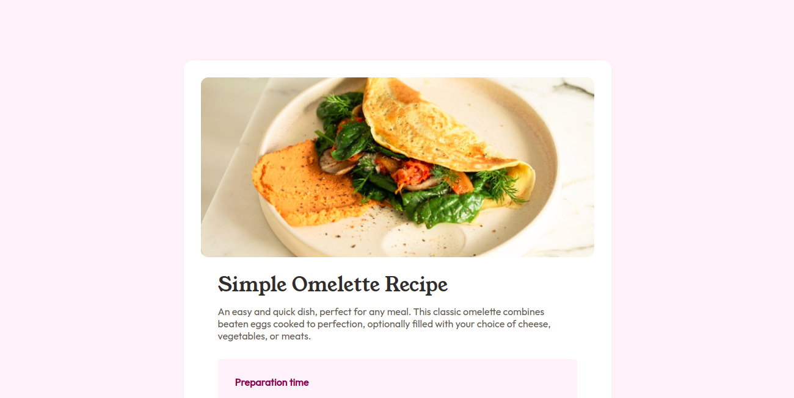

# Frontend Mentor - Recipe page solution

This is a solution to the [Recipe page challenge on Frontend Mentor](https://www.frontendmentor.io/challenges/recipe-page-KiTsR8QQKm). Frontend Mentor challenges help you improve your coding skills by building realistic projects.

## Table of contents

- [Overview](#overview)
  - [The challenge](#the-challenge)
  - [Screenshot](#screenshot)
  - [Links](#links)
- [My process](#my-process)
  - [Built with](#built-with)
  - [What I learned](#what-i-learned)
- [Author](#author)

## Overview

### Screenshot



### Links

- Solution URL: [Code Repository](https://github.com/Melbita/recipe-page)
- Live Site URL: [Recipe Page Site](https://melbita.github.io/recipe-page/)

## My process

### Built with

- Semantic HTML5 markup
- CSS custom properties
- Flexbox
- CSS Grid
- Mobile-first workflow

### What I learned

I learned how to style some list types properties

```css
    .recipe__instructions{    
      ol {

        counter-reset: my-counter; /* Initialize a counter */

        li{
          list-style-position: inside;
          padding: var(--spacing-mini);
          counter-increment: my-counter;
          
          &::before {
            content: counter(my-counter) ". ";
            font-weight: bold;
            margin-right: 0.5em; 
            color: var(--brown-800)
          }
        }
      } 
	}
```

## Author

- Frontend Mentor - [@melbita](https://www.frontendmentor.io/profile/melbita)
